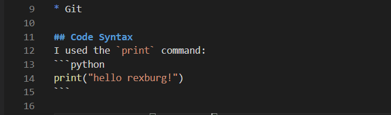

# Hello World Demo
This is my **Hello World Demo** software.

## Tools
### Third

* Python
* Visual Studio Code
* Git

## Code Syntax
I used the `print` command:
```python
print("hello rexburg!")
```

[python homepage](python.com)

